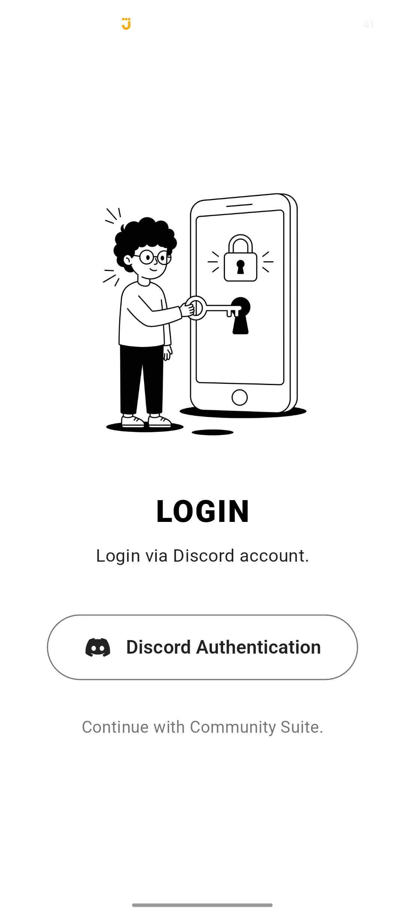
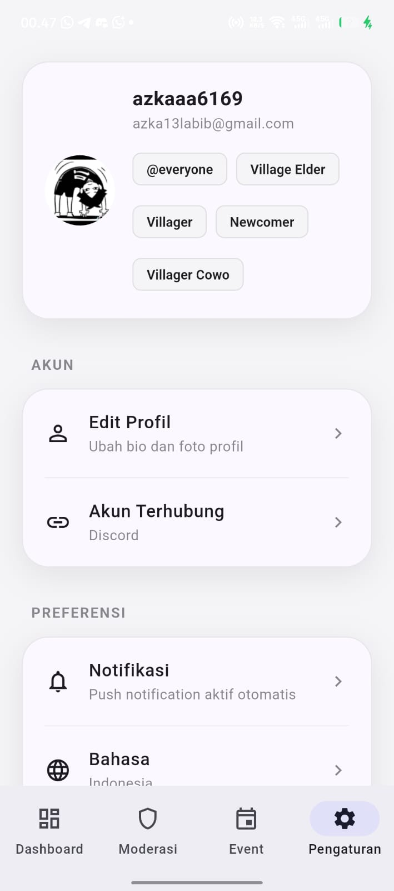

# Community Suite


**Community Suite** adalah aplikasi seluler modern (berbasis Flutter) yang dirancang khusus untuk administrator dan moderator komunitas Discord. Aplikasi ini memungkinkan Anda mengelola server, memoderasi anggota, dan memantau statistik langsung dari genggaman Anda.

---

## Fitur Utama

- **Dashboard Statistik Real-time**: Pantau jumlah member, status online, channel teks/suara, role, boost, dan ping bot secara *real-time*.
- **Sistem Moderasi Lengkap**: Fitur *Quick Action* (Warn, Mute, Kick, Ban) dengan antarmuka yang intuitif dan berwarna.
- **Manajemen Event**: Buat dan kelola *event* komunitas (Mabar, Nobar, Rapat) langsung dari aplikasi.
- **Dukungan Multi-Bahasa**: Tersedia dalam Bahasa Indonesia (ID) dan English (EN) dengan transisi mulus tanpa *restart*.
- **Premium UI/UX**: Desain modern dengan *gradient header*, animasi transisi yang halus, dan mode Gelap/Terang (Dark/Light Mode).
- **Push Notifications**: Dapatkan pemberitahuan langsung saat ada aktivitas penting di server.

---

## Teknologi yang Digunakan

### Mobile App (Frontend)
- **Framework**: [Flutter](https://flutter.dev/)
- **State Management**: Provider
- **Localization**: Sistem lokalisasi internal yang ringan
- **UI/UX**: Custom Material Design dengan palet warna ala Discord (`#5865F2`)

### Backend 
- **Database**: [Supabase](https://supabase.com/) (PostgreSQL)
- **API**: Custom REST API / WebSockets
- **Notifikasi**: Firebase Cloud Messaging (FCM) / Supabase Edge Functions

---

## Cara Menjalankan (Local Development)

### Persyaratan Sistem
- Flutter SDK (versi terbaru)
- Android Studio / Xcode (untuk emulator)
- Node.js (untuk backend lokal, opsional)

### Langkah-langkah
1. **Clone Repositori**
   ```bash
   git clone https://github.com/azka13labib-ops/OpsBase.git
   cd OpsBase/mobile-app
   ```

2. **Install Dependensi**
   ```bash
   flutter pub get
   ```

3. **Konfigurasi Lingkungan (Config)**
   Buka file `lib/config.dart` dan sesuaikan `backendApiUrl` dengan IP lokal Anda atau URL server Anda.
   *(Catatan: Jika menggunakan HP fisik dengan koneksi USB, Anda bisa menggunakan `adb reverse tcp:3000 tcp:3000` dan set IP ke `127.0.0.1`)*.

4. **Jalankan Aplikasi**
   ```bash
   flutter run
   ```

---

## Tampilan Layar 

<div align="center">
  
  
</div>

---

## Kontribusi

Kami sangat terbuka dengan kontribusi! Jika Anda menemukan bug atau memiliki ide fitur baru:
1. *Fork* repositori ini.
2. Buat *branch* fitur Anda (`git checkout -b feature/FiturKeren`).
3. Lakukan *commit* dengan metode [Semantic Commits](https://www.conventionalcommits.org/) (`git commit -m "feat: tambah fitur keren"`).
4. *Push* ke branch tersebut (`git push origin feature/FiturKeren`).
5. Buka *Pull Request*.

---

## Lisensi

Proyek ini dilisensikan di bawah [MIT License](LICENSE) - lihat file LICENSE untuk detail lebih lanjut.
